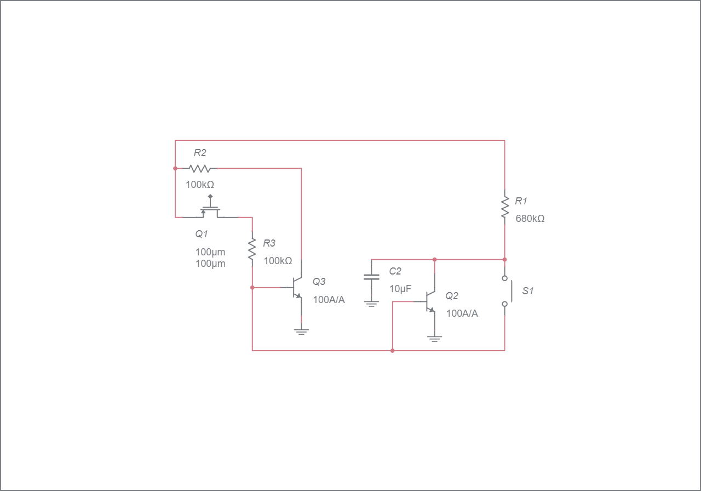

# Latch Circuit 
## explanation
When you power the circuit, all transistors are OFF. The Q1 MOSFET is the one that enables the output, so the current path from IN to OUT.
 this BJT will also turn ON. The collector of this transistor is also connected to taht R3 resistor and the C1 capacitor. So, since now this Q3 is ON and creates a path to ground, the C1 which was previously charged up by the R3 resistor, will now discharge to GND.
so when the button is pressd there will not be any charge in C1 and will turn off the circuite  

## Circuit:

## Participated in the Task: 
- Abdulwahab Dhifallah [@Elechop](https://github.com/Elechop)
